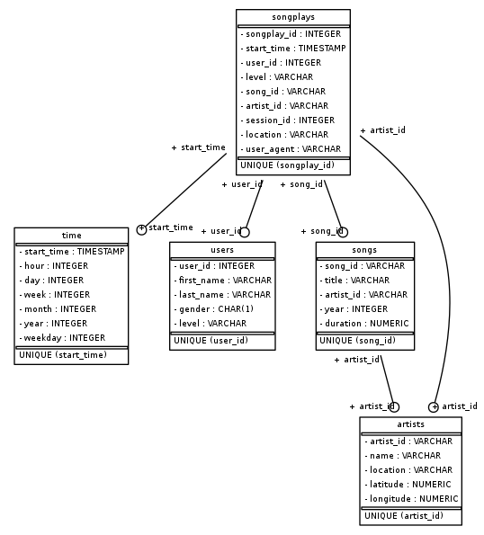

# Summary of the project
Sparkify is a startup which wants to analyze the data they've been collecting on songs and user activity on their new music streaming app. The analytics team is particularly interested in understanding what songs users are listening to. 

# Database schema

## Fact Table
### songplays 
Records in log data associated with song plays

| column        | type          |
| ------------- |:-------------:| 
| songplay_id   | serial (PK)   | 
| start_time    | TIMESTAMP (FK)|
| user_id       | int (FK)      |
| level         | varchar       |
| song_id       | varchar (FK)  | 
| artist_id     | varchar (FK)  |
| session_id    | int           |
| location      | varchar       |
| user_agent    | varchar       |

## Dimension Tables
### users
users in the app

| column        | type          |
| ------------- |:-------------:| 
| user_id       | int (PK)      |
| first_name    | varchar       |
| last_name     | varchar       |
| gender        | varchar       |
| level         | varchar       |

### songs
songs in music database

| column        | type          |
| ------------- |:-------------:|
| song_id       | varchar )PK)  |
| title         | varchar       |
| artist_id     | varchar (FK)  |
| year          | int           |
| duration      | float         |

### artists
artists in music database
| column        | type          |
| ------------- |:-------------:|
| artist_id     | varchar (PK)  |
| name          | varchar       |
| location      | varchar       |
| latitude      | numeric       |
| longitude     | numeric       |

### time
timestamps of records in songplays broken down into specific units
| column        | type          |
| ------------- |:-------------:|
| start_time    | TIMESTAMP (PK |
| hour          | int           |
| day           | int           |
| week          | int           |
| month         | int           |
| year          | int           |
| weekday       | int           |

## ERD

# Files in the repository
- *Log Dataset*: This dataset consists of log files in JSON format generated by a event simulator based on the songs in the song dataset. The log files in the dataset are partitioned by year and month. 
- *Song Dataset*: This dataset is a subset of real data from the Million Song Dataset. Each file is in JSON format and contains metadata about a song and the artist of that song. The files are partitioned by the first three letters of each song's track ID. 
- *test.ipynb*: displays the first few rows of each table to let you check the database.
- *create_tables.py*: drops and creates the tables. Run this file to reset the tables before each time you run the ETL scripts.
- *etl.ipynb*: reads and processes a single file from song_data and log_data and loads the data into the tables. This notebook contains detailed instructions on the ETL process for each of the tables.
- *etl.py*: reads and processes files from song_data and log_data and loads them into the tables.
- *sql_queries.py*: contains all the sql queries, and is imported into the last three files above.

# How to run the Python scripts
1. Run *create_tables.py* to create the database and tables.
2. Run *etl.py* to load the data into the project's tables.
